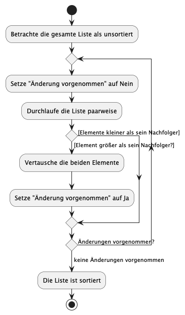
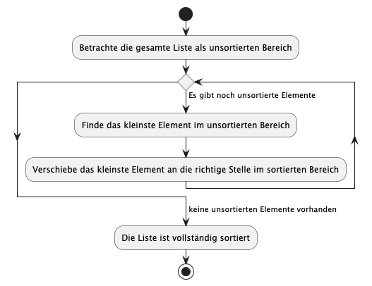
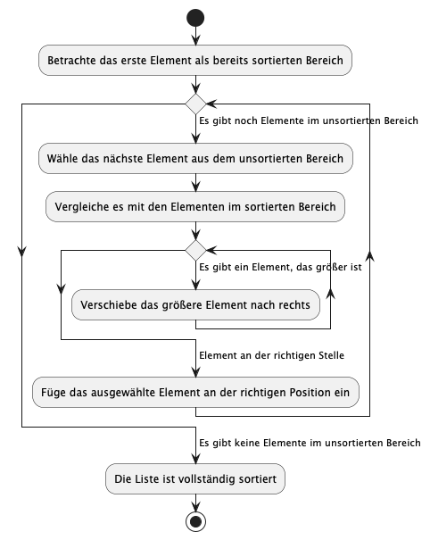

# Aufgabe: Laptop-Katalog sortieren

## Betriebliche Anforderung: Laptop-Katalog sortieren

Uhr erhaltet den Auftrag, den Laptop-Katalog unseres IT-Unternehmens *TechWorld Solutions* zu optimieren. Dazu steht euch eine CSV-Datei mit Laptop-Daten zur Verfügung (Marke, Prozessor, RAM, Storage, GPU, Bildschirmgröße, Auflösung, Akkulaufzeit, Gewicht, Betriebssystem und Preis). Euer Ziel ist es, die Laptops anhand ihres Preises zu sortieren.

### Warum diese vier Algorithmen?
- **Bubble Sort:** Ein einfacher, intuitiver Ansatz, der euch das Prinzip von wiederholtem Vergleichen und Tauschen nahebringt.
- **Selection Sort:** Verdeutlicht, wie man durch systematisches Suchen und Auswählen des minimalen Elements eine Liste sortieren kann.
- **Insertion Sort:** Zeigt, wie man schrittweise eine sortierte Liste aufbaut, indem man Elemente an der richtigen Position einfügt.
- **Quick Sort:** Demonstriert das effiziente "Teile und herrsche"-Prinzip, das in vielen praktischen Anwendungen eingesetzt wird.

---

## Aufgaben

### Aufgabe 1: Sortieren mit Bubble Sort
- **Ziel:** Lest die CSV-Datei ein und sortiert die Laptops nach dem Preis mithilfe von Bubble Sort.
- **Vorgehen:**
  1. Extrahiert die Preisdaten aus der CSV.
  2. Wendet den Bubble Sort an, der benachbarte Elemente vergleicht und bei Bedarf vertauscht.
  3. Wiederholt diesen Vorgang, bis die Liste vollständig sortiert ist.
  

# Aufgabe 2: Sortieren mit Selection Sort

**Ziel:**  
Sortiert die Laptops nach Preis, indem ihr Selection Sort einsetzt.

**Vorgehen:**  
1. Lest die CSV-Daten ein und extrahiert die Preisinformationen.  
2. Bestimmt in jedem Durchgang das kleinste Element (den günstigsten Preis) im unsortierten Teil der Liste.  
3. Tauscht dieses Element mit dem ersten Element des unsortierten Bereichs.  
4. Wiederholt diesen Vorgang, bis die gesamte Liste sortiert ist.  

# Aufgabe 3: Sortieren mit Insertion Sort

**Ziel:**  
Sortiert die Laptop-Daten, indem ihr schrittweise jedes Element (Preis) in den bereits sortierten Teil der Liste einfügt.

**Vorgehen:**
1. Lest die CSV-Datei ein und extrahiert die Preisinformationen.
2. Beginnt mit dem zweiten Element der Liste.
3. Vergleicht das aktuelle Element (key) mit den bereits sortierten Elementen links davon.
4. Verschiebt die Elemente, solange sie größer als der key sind, um Platz für den key zu schaffen.
5. Fügt den key an der richtigen Position ein.
6. Wiederholt diesen Vorgang, bis die gesamte Liste sortiert ist.

# Aufgabe 4: Sortieren mit Quick Sort

**Ziel:**  
Nutze Quick Sort, um den Laptop-Katalog effizient nach dem Preis zu sortieren.

**Vorgehen:**
1. Lest die CSV-Datei ein und extrahiert die Preisinformationen.
2. Wählt ein Pivot-Element (zum Beispiel den mittleren Preis der Liste).
3. Partitioniert die Liste in zwei Teilmengen:
  - Elemente, die kleiner als das Pivot sind
  - Elemente, die größer als das Pivot sind
4. Wendet Quick Sort rekursiv auf beide Teilmengen an.
5. Kombiniert die sortierten Teillisten mit dem Pivot, um die vollständig sortierte Liste zu erhalten.

# Aufgabe 5 (Zusatzaufgabe): Strategy Pattern für Sortieralgorithmen

**Ziel:**  
Implementiert das Strategy Pattern, um die vier Sortieralgorithmen (Bubble Sort, Selection Sort, Insertion Sort und Quick Sort) flexibel austauschen zu können.

**Vorgehen:**  
1. Entwickelt eine gemeinsame Schnittstelle oder abstrakte Klasse, die die Sortierfunktionalität kapselt.  
2. Implementiert für jeden der vier Sortieralgorithmen eine eigene Klasse, die diese Schnittstelle realisiert.  
3. Erstellt eine Kontext-Klasse, die zur Laufzeit entscheidet, welcher Sortieralgorithmus verwendet wird (z.B. basierend auf der Größe der Datenmenge oder anderen Kriterien).  
4. Nutzt die CSV-Datei, um die Laptops nach Preis zu sortieren und testet eure Implementierung.  

